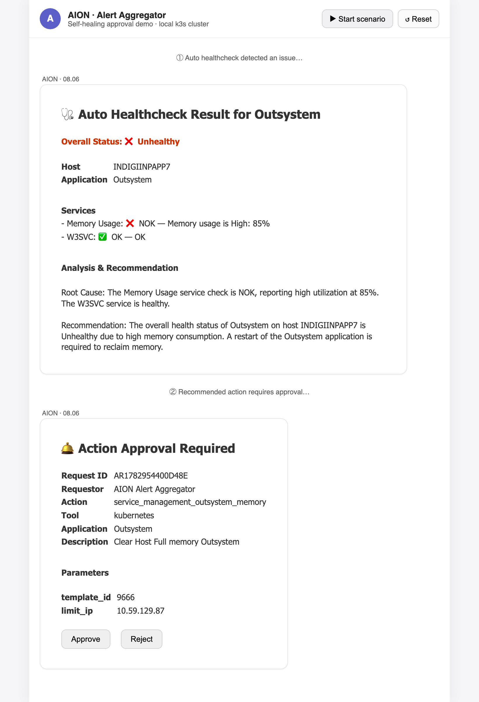
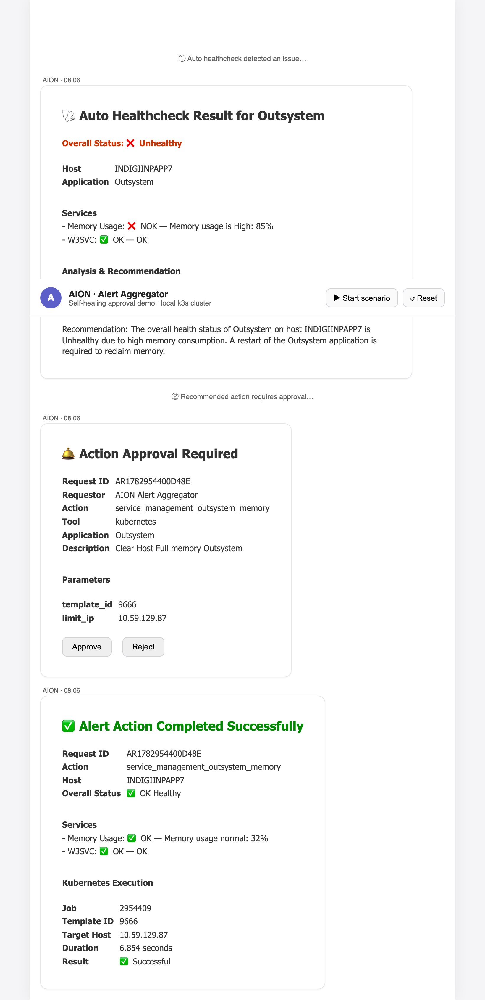

# Self-Healing Pipeline

Automated **detect → classify → fix → validate → report** loop for Kubernetes workloads,
with run summaries delivered to **Microsoft Teams as Adaptive Cards**.

This is the Claude Code / Kubernetes reimagining of the OpenClaw "Self-Healing Pipeline"
QA workflow, focused on healing deployment regressions on a cluster. It reuses the
multi-agent SRE modules (`src/agents`, `src/tools`, `src/orchestration`, …) from the
original AIOps SRE agent as a base, and adds two new packages:

- `src/self_healing/` — the pipeline (kube client, coverage matrix, L1 tests, L2 fix, orchestrator)
- `src/notifications/` — Microsoft Teams Adaptive Card builders + delivery client

## How it works

| Phase | What it does | Module |
|-------|--------------|--------|
| 1 — L1 test | Probe deployment readiness + service endpoints | `self_healing/l1_tests.py` |
| 2 — Classify | Match the failure signal to the coverage matrix (runbook) | `self_healing/runbook.py` |
| 3 — L2 fix | Apply the runbook remediation (reset image / restart rollout) | `self_healing/l2_fix.py` |
| 5 — Validation | Re-run L1 to confirm the fix | `self_healing/orchestrator.py` |
| 7 — Report | Render an Adaptive Card and post it to Teams | `notifications/` |

The coverage matrix maps a **failure signal** to a **runbook** with a confidence tier
(`autoFixable`, `guidedInvestigate`, `escalate`, …). Unknown signals escalate instead of
guessing. Only two mutating kube actions are ever taken — `set image` and `rollout restart` —
so the blast radius is auditable.

## Quick start (local cluster)

Prerequisites: `kubectl`, and a local cluster. This was validated on **colima** (k3s):

```bash
colima start --kubernetes --cpu 2 --memory 4 --vm-type vz
```

Set up a light virtualenv (the pipeline itself only needs pydantic + httpx):

```bash
uv venv .venv
uv pip install --python .venv/bin/python pydantic pydantic-settings "httpx<1.0" pytest pytest-asyncio
```

Run the demo. The sample app is deployed with a **deliberately broken image tag**
(`traefik/whoami:v9.9.9-broken-drift`) so the pipeline has something to heal:

```bash
export PYTHONPATH=$PWD
.venv/bin/python run_pipeline.py setup    # deploy the broken app
.venv/bin/python run_pipeline.py status   # healthy: False (ErrImagePull, 0 endpoints)
.venv/bin/python run_pipeline.py run      # detect -> fix -> validate -> print Adaptive Card
.venv/bin/python run_pipeline.py status   # healthy: True (reset to traefik/whoami:v1.10.1)
```

Expected `run` phase log:

```
Phase 1 (L1): 1 failure(s) detected
Phase 2 (Classify): F001 -> autoFixable (RB-INFRA-001)
Phase 3 (L2): F001 FIXED — Set image -> traefik/whoami:v1.10.1; rollout succeeded
Phase 5 (Validation): 0 failure(s) remain
```

`run` exits `0` when the run ends clean (`all_clear`), non-zero otherwise — so CI/cron can gate on it.

## Microsoft Teams delivery

Delivery targets a Teams incoming webhook (Power Automate "Workflows" webhook or a classic
Office 365 connector). Set the URL and the pipeline posts the rendered Adaptive Card:

```bash
export TEAMS_WEBHOOK_URL="https://…/workflows/…"   # from your Teams flow
.venv/bin/python run_pipeline.py run
# -> Teams delivery: sent
```

The payload is a Teams message envelope wrapping an `application/vnd.microsoft.card.adaptive`
attachment (schema 1.4). When `TEAMS_WEBHOOK_URL` is unset, delivery is skipped gracefully and
the card JSON is still printed.

There is also a delivery endpoint for an external orchestrator (cron/agent) to POST a structured
run summary and have this service render + deliver it: `POST /api/v1/pipeline/report`.

## End-to-end approval demo (Teams-style, interactive)

Reproduces the AION "Action Approval Required" flow with a clickable web UI that
renders the **real Adaptive Cards** (via the official Adaptive Cards JS renderer),
backed by a **real remediation** on the local cluster:

```
① Auto Healthcheck  → ❌ Unhealthy (Memory 85% NOK, W3SVC OK) + analysis/recommendation
② Action Approval Required → interactive card with [Approve] [Reject]
③ Approve → remediation (rollout restart) → verify → ✅ Completed Successfully / OK Healthy
```

| ① Alert + approval | ② Approved + healed |
|---|---|
|  |  |

Run it:

```bash
uv pip install --python .venv/bin/python fastapi "uvicorn[standard]"
export PYTHONPATH=$PWD
.venv/bin/python run_demo.py        # http://127.0.0.1:8080
```

Open the page and click **Start scenario**. The Approve/Reject buttons round-trip
through `POST /api/demo/approve|reject`, which execute the real remediation and
return the completion card. Backend endpoints (also drivable via `curl`):

| Endpoint | Purpose |
|----------|---------|
| `POST /api/demo/reset` | Deploy the app healthy and seed the memory fault (85%) |
| `POST /api/demo/healthcheck` | Healthcheck card (readiness is real, memory simulated) |
| `POST /api/demo/request-approval` | Recommend action + interactive approval card |
| `POST /api/demo/approve` | Execute real rollout restart, verify, return result card |
| `POST /api/demo/reject` | Reject without touching the cluster |

> The memory metric is simulated (deterministic demo); the **remediation action is
> real** (see backends below). The approval card actions carry
> `{"verb": "approve"|"reject", "requestId": …}`.

## Remediation backends (Kubernetes / Ansible / AWX)

The approved action is executed by a pluggable backend selected via `EXECUTOR`:

| `EXECUTOR` | Backend | What it does |
|-----------|---------|--------------|
| _(unset)_ | `KubernetesExecutor` | `kubectl rollout restart` on the deployment (default, zero deps) |
| `ansible` | `AnsibleExecutor` | Runs a real `ansible-playbook` (`deploy/ansible/restart_app.yml`) |
| `awx` + `AWX_URL` | `AwxExecutor` | Launches an AWX/Tower job template over REST and polls it to completion |

```bash
uv pip install --python .venv/bin/python ansible-core   # for EXECUTOR=ansible
EXECUTOR=ansible .venv/bin/python run_demo.py

AWX_URL=https://awx.example AWX_TOKEN=xxx EXECUTOR=awx .venv/bin/python run_demo.py
```

The production flow uses AWX template ids (9665/9666); the demo carries those ids
through so the report matches. Swap in the real Ansible playbook / AWX template to
target actual hosts instead of the local cluster.

## Connect to real Microsoft Teams

The approval buttons are `Action.Execute` (Teams **Universal Actions**). Point a
Teams bot or a Power Automate flow at the bot messaging endpoint:

```
POST /api/teams/messages
```

It handles the `adaptiveCard/action` invoke, runs approve/reject, and returns a
refreshed Adaptive Card (`{"statusCode":200,"type":"application/vnd.microsoft.card.adaptive","value":…}`)
that Teams renders in place. For the Teams **outgoing webhook** model, set
`TEAMS_OUTGOING_WEBHOOK_SECRET` (base64) and the endpoint verifies the HMAC
signature on every request (unsigned requests get `401`).

To *post* the initial approval card into a channel, use the incoming webhook
(`TEAMS_WEBHOOK_URL`) via `src/notifications` — see below.

## Tests

```bash
PYTHONPATH=$PWD .venv/bin/python -m pytest \
  tests/test_self_healing.py tests/test_teams_notifications.py \
  tests/test_approvals.py tests/test_teams_endpoint.py -q
```

`test_self_healing.py` exercises the full detect→fix→validate loop against an in-memory fake
cluster (no kubectl needed); `test_teams_notifications.py` covers the Adaptive Card builders and
the real HTTP delivery path.

## Commands reference

| Command | Purpose |
|---------|---------|
| `run_pipeline.py setup` | Apply the sample workload manifest (`deploy/sample-app.yaml`) |
| `run_pipeline.py break` | Re-introduce the bug (set the broken image) |
| `run_pipeline.py status` | Print current image, availability, endpoints |
| `run_pipeline.py run` | Execute the pipeline and print/deliver the report |
