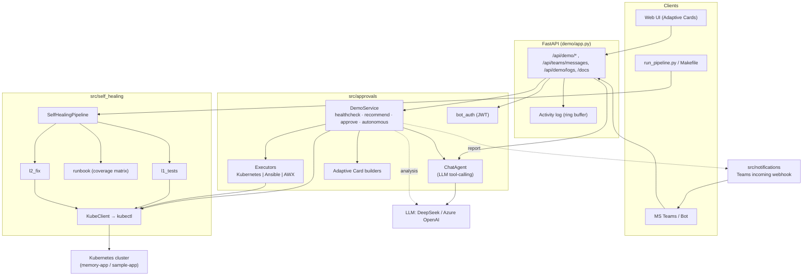

# Architecture

Two entry points share the same domain: an **autonomous CLI pipeline** (image-drift
self-healing) and an **approval/agent demo server** (memory scenario, Teams-style).
Both act on a real Kubernetes cluster; the LLM is advisory only.

## Components

## Request flow — approval demo

1. **Detect** — `DemoService.healthcheck()` reads real readiness (deployment/endpoints)
   and real memory (`KubeClient.pod_memory_percent` → pod cgroup), plus identity
   (`pod_identity` → node/pod/IP).
2. **Analyze** — `analysis.build_analysis()` asks the LLM (or templates) for a
   root-cause + recommendation narrative.
3. **Recommend** — `recommend_action()` builds an `ActionSpec` with **cluster-derived**
   parameters (namespace/deployment/pod/node), or AWX params under the AWX executor.
4. **Decide** —
   - *Approval mode:* `create_approval()` → interactive Adaptive Card; a human clicks
     Approve/Reject (web `Action.Execute`, or Teams invoke → `/api/teams/messages`).
   - *Autonomous mode:* `autonomous_remediate()` executes immediately for `autoFixable`.
5. **Execute** — the selected `Executor` performs the real remediation
   (`KubernetesExecutor` = `kubectl rollout restart`; `AnsibleExecutor` = a real
   `ansible-playbook`; `AwxExecutor` = launch + poll an AWX job).
6. **Verify** — a fresh healthcheck confirms healthy; a completion card is returned.

## Request flow — autonomous pipeline (image drift)

`SelfHealingPipeline.run()`: `l1_tests` (readiness/drift) → `runbook.classify`
(coverage matrix → tier) → `l2_fix` (reset image / rollout restart) → validation.
No human in the loop; exits non-zero if unresolved (CI/cron-friendly).

## Trust boundaries / auth

- **Teams inbound** (`/api/teams/messages`): Bot Framework **JWT** when
  `MICROSOFT_APP_ID` is set; otherwise HMAC (outgoing webhook) or open (dev).
- **Remediation is gated**: the LLM can only *propose*; execution needs approval or
  the autonomous policy. Only two mutating kube verbs are used (set image, rollout
  restart).

## Observability

`demo/trace.py` attaches a ring-buffer log handler to the `src`/`demo` loggers;
`GET /api/demo/logs` and the UI "Under the hood" panel stream the real operations
(kubectl commands, cgroup reads, executor actions, LLM tool calls).

## What's real vs staged

Real: cluster, readiness, memory metric (cgroup), remediation, identity, LLM
analysis, Teams card contract + JWT. Staged: induced memory pressure (`/leak`) and
branding. See `docs/USE_CASES.md`.
