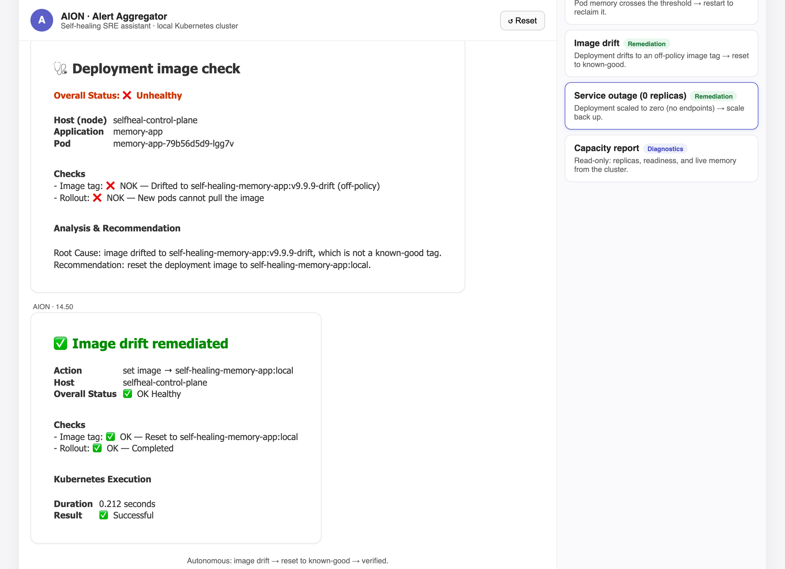
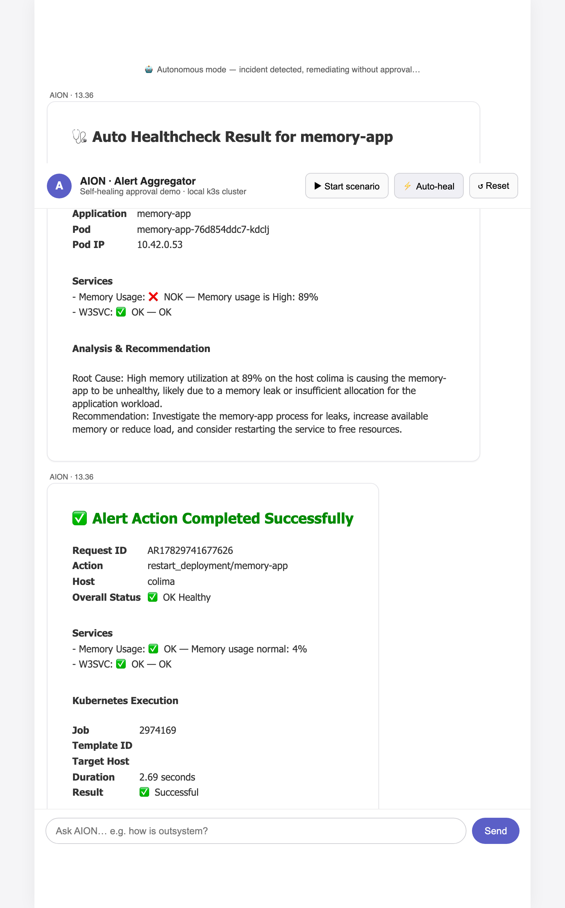
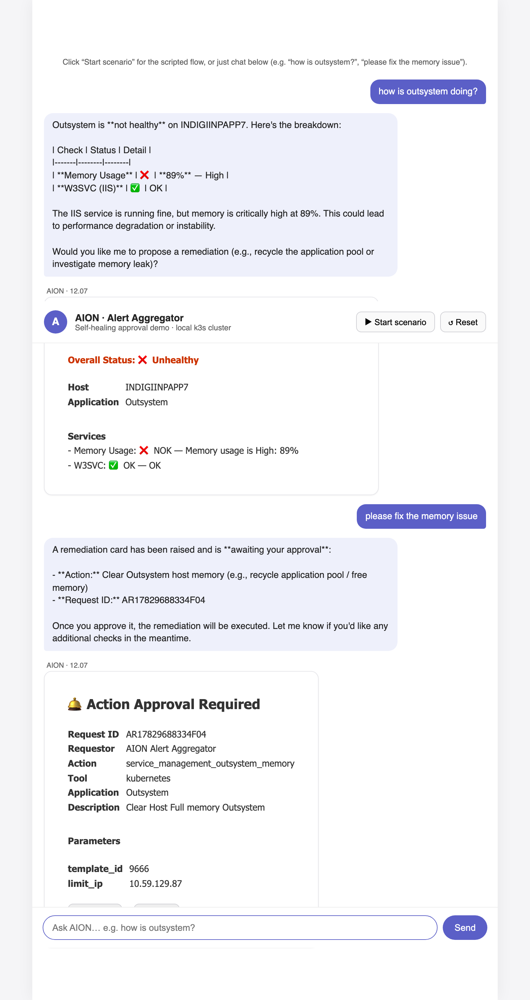

# Demo Use Cases

What each part of this project demonstrates, how to trigger it, and what "success"
looks like. All of these run against a real local Kubernetes cluster (kind or
colima/k3s). Both the remediation and the memory metric are **real**: the demo target
(`memory-app`) allocates actual memory on `/leak`, the metric is read from the pod
**cgroup** (`/sys/fs/cgroup/memory.current` ÷ `memory.max`), and a rollout restart
frees it.

The demo UI is split: **left = chatbot** (free-text LLM agent), **right = use-case
list**. Each use case induces a real fault and remediates/inspects it — results render
in the chat on the left.

Use cases in the sidebar: **High memory** (restart), **Image drift** (reset image),
**Service outage / 0 replicas** (scale up), and **Capacity report** (read-only
diagnostics) — a mix of remediation and diagnostics, not just auto-healing.

## 1. Approval-gated remediation (the AION memory flow)

The headline use case, mirroring the production AION "Action Approval Required" cards.

- **Trigger:** `make demo` → open http://127.0.0.1:8080 → **Start scenario**
- **Flow:** Auto Healthcheck reports **Unhealthy** (Memory 85% NOK, W3SVC OK) →
  analysis + recommendation → interactive **Action Approval Required** card →
  a human clicks **Approve** → real remediation runs → verification healthcheck →
  **✅ Completed Successfully / OK Healthy**.
- **Proof:** watch `kubectl -n self-healing get pods -w` — the pod restarts on Approve.

## 1b. Autonomous remediation (no approval) — the "⚡ Auto-heal" button

The same incident, remediated **without a human** — the AIOps autonomous path.

- **Trigger:** `make demo` → click **⚡ Auto-heal** (or `POST /api/demo/autonomous`).
- **Flow:** incident created → healthcheck (Unhealthy) → recommended action classified
  `autoFixable` → **executed immediately** (real rollout restart) → verified healthy.
  No approval card, no buttons.
- **Policy:** autonomous is meant for high-confidence, low-risk actions. Risky/unknown
  actions still go through the approval path (use case 1). This mirrors the coverage-
  matrix tiers (`autoFixable` → auto; `escalate` → human).

## 2. Reject path (no action taken)

- **Trigger:** in the demo, click **Reject** instead of Approve.
- **Success:** card shows **⛔ Action Rejected**; the cluster is untouched and stays
  unhealthy. Nothing is executed.

## 3. Self-healing deployment (image drift / ImagePullBackOff)

Autonomous detect → fix loop with no human in the loop, for a broken deployment.

- **Trigger:** `make pipeline-setup` (deploys a broken image) then `make pipeline-run`
- **Flow:** L1 readiness check fails (ErrImagePull, 0 endpoints) → classified against
  the coverage matrix (`RB-INFRA-001`, autoFixable) → image reset to the known-good
  tag → rollout → validation passes.
- **Success:** `make pipeline-status` → `healthy: True`; run exits `0` when clean.

## 4. Pluggable remediation backends (Kubernetes / Ansible / AWX)

The same approval flow, different execution engine — selected via `EXECUTOR`.

- **Kubernetes (default):** `make demo` → remediation is `kubectl rollout restart`.
- **Ansible:** `make demo-ansible` → runs a real `ansible-playbook`
  (`deploy/ansible/restart_app.yml`); result card header reads **Ansible Execution**.
- **AWX/Tower:** `AWX_URL=… AWX_TOKEN=… EXECUTOR=awx make demo` → launches a job
  template over REST and polls it (matches the production template ids 9665/9666).

## 5. Microsoft Teams delivery + interactive approval

- **Outbound card:** render an Adaptive Card and post it to a Teams incoming webhook
  (`TEAMS_WEBHOOK_URL`) via `src/notifications` — pipeline reports and alert analyses.
- **Interactive approval in Teams:** point a Teams bot / Power Automate flow at
  `POST /api/teams/messages`. Approve/Reject clicks arrive as an
  `adaptiveCard/action` invoke; the endpoint executes the decision and returns a
  refreshed card. With `TEAMS_OUTGOING_WEBHOOK_SECRET` set, requests are HMAC-verified
  (unsigned → `401`).

## 6. LLM-generated analysis (optional, provider-selectable)

The **Root Cause + Recommendation** narrative can be generated by an LLM instead of
the built-in template. Detection and remediation stay rule-based; only the wording
is LLM-generated (matching how AION phrases its analysis).

- **Select provider:** `LLM_PROVIDER=deepseek` or `LLM_PROVIDER=azure` (unset =
  auto-detect by which credentials are set; `none` = always template).
- **DeepSeek:** set `DEEPSEEK_API_KEY`.
- **Azure OpenAI:** set `AZURE_OPENAI_ENDPOINT`, `AZURE_OPENAI_API_KEY`,
  `AZURE_OPENAI_CHAT_DEPLOYMENT`.
- **Fallback:** with no credentials, the deterministic template is used, so the
  demo always runs offline. LLM failures also fall back silently.

## 7. Conversational agent (LLM tool-calling, approval-gated)

Chat with AION in free text; the LLM decides which tools to call. Type into the
demo's chat box (e.g. *"how is outsystem?"*, *"please fix the memory issue"*).

- **Tools the agent can call:** `get_healthcheck` (inspect the host) and
  `propose_remediation` (open an approval card). The agent **cannot execute** —
  it can only propose; remediation runs only when a human clicks Approve.
- **Provider:** DeepSeek or Azure OpenAI (`LLM_PROVIDER`). Without credentials the
  chat replies that the LLM is not configured (the button-driven flow still works).
- **Endpoint:** `POST /api/demo/chat {session_id, message}` → `{reply, cards}`.

## 8. Drift detection (running but off-policy image tag)

- **Behavior:** even when pods are healthy, an image tag that doesn't match the
  expected pattern (e.g. `latest` instead of `vX.Y.Z`) is flagged as `image_drift`
  and remediated by resetting to the known-good tag.

---

### Backend actions vs simulation (be explicit)

| Element | Local demo | Production mapping |
|---------|-----------|--------------------|
| Remediation (restart) | **Real** k8s rollout restart / real ansible-playbook | AWX job on the real host |
| Memory metric | **Real** — allocated in `memory-app`, read from the pod cgroup | Real host metric via monitoring / Ansible healthcheck |
| Identity (host/pod/IP) | **Real** — node, pod name, pod IP read from k3s | Alert payload + inventory/CMDB |
| Remediation parameters | **Real** — namespace/deployment/pod/node from the cluster | AWX template id + host |
| Analysis narrative | **Real LLM** (Azure OpenAI / DeepSeek) or template fallback | LLM (AION) |
| Target | k8s `memory-app` (demo) / `sample-app` whoami (image-drift pipeline) | Windows/IIS host, OutSystems |
| Teams cards | Real Adaptive Cards (web renderer + invoke contract) | Real Teams tenant via bot / Power Automate |

> Identity now comes from the cluster: `Host (node)` is the k3s node, plus the real
> `Pod` and `Pod IP`. The AWX-style `template_id` only appears when the AWX executor
> is selected; the default Kubernetes executor uses real namespace/deployment/pod/node
> parameters.
